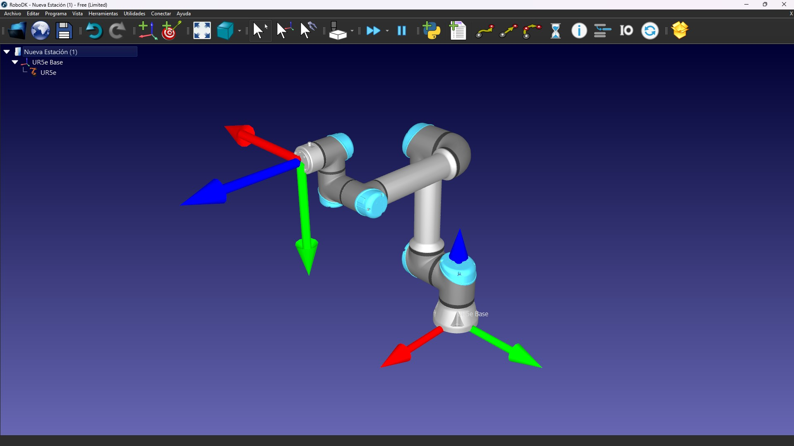
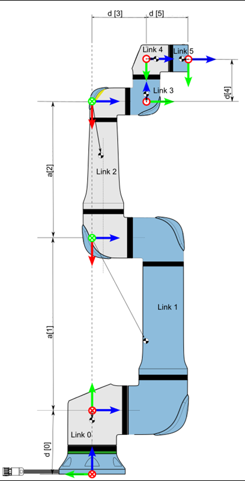
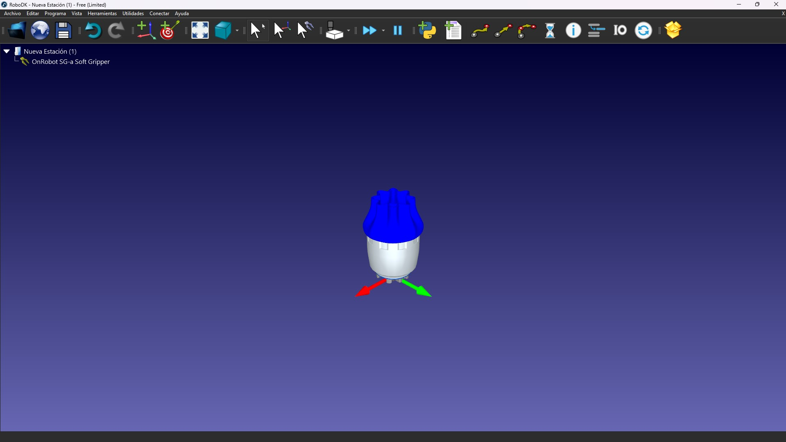
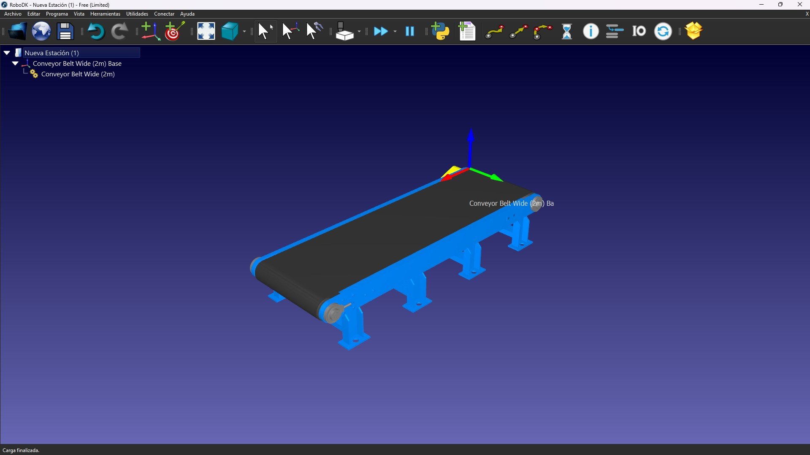
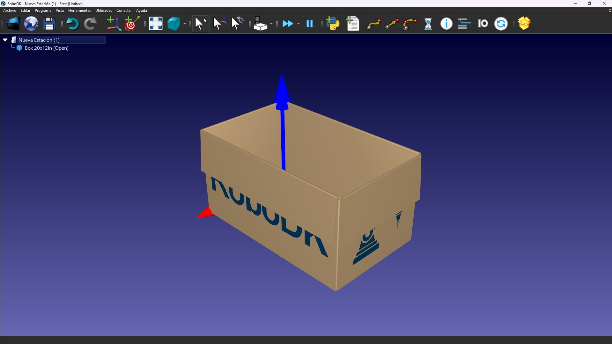
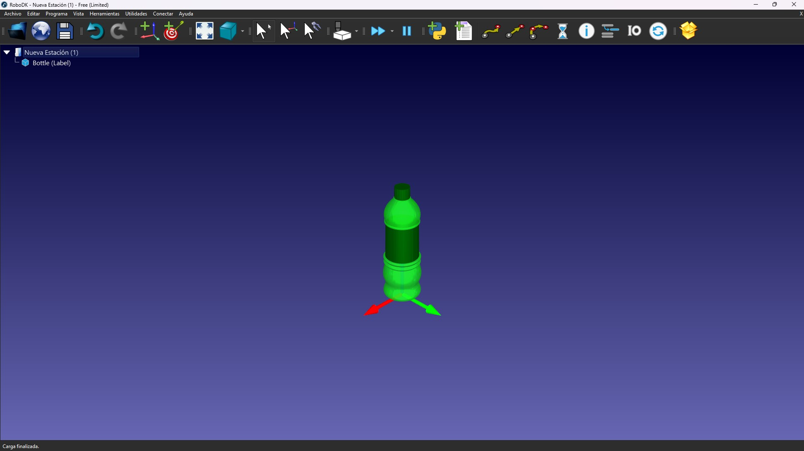
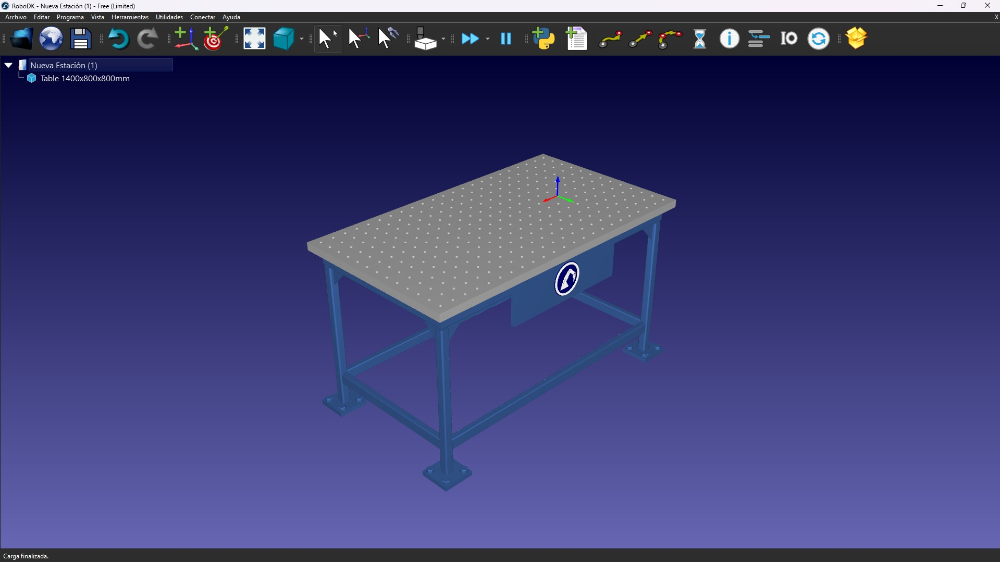

# Espacio y herramientas de trabajo

> Proyecto de Leo González Yamada

Es el siguiente espacio, se explican los objetos a usar en el espacio de trabajo virtual de **RoboDK**.

---

## Contenido
- [UR5e](#ur5e)
- [OnRobot SG-a Soft Gripper](#onrobot-sg-a-soft-gripper)
- [Conveyor Belt Wide (2m)](#conveyor-belt-wide-2m)
- [Caja](#caja)
- [Botella](#botella)
- [Mesa de trabajo](#mesa-de-trabajo)

---

## UR5e

El **UR5e** es un robot colaborativo (cobot) perteneciente a la e-Series de Universal Robots. Diseñado para integrarse en procesos de manufactura flexible, este manipulador destaca por su equilibrio entre alcance, capacidad de carga y precisión, siendo una de las opciones más robustas para aplicaciones de Pick and Place y ensamblaje ligero.

> [Modelo de **UR5e**](https://robodk.com/robot/es/Universal-Robots/UR5e) de la biblioteca de RoboDK.

### Caracterísitcas principales

- **Grados de Libertad** (GDL): Cuenta con 6 articulaciones rotacionales, lo cuál, lo convierte en un robot **no redundante**, lo que significa que es capaz de maniobrar libremente en su espacio de trabajo de 6 dimenciones, que involucra 3 cartesianos (x, y z) y 3 rotacionales (rx, ry y rz).

- **Capacidad de Carga y Alcance**: Es capaz de cargar **5 kg** y cuenta con un radio de alcance de hasta **850 mm**.

- **Precisión y Repetibilidad**: Ofrece una repetibilidad de pose de **±0.03 mm**, lo que garantiza que los cálculos de cinemática inversa se traduzcan en movimientos exactos y constantes.

### Articulaciones

- Base
- Hombro
- Codo
- Muñeca 1
- Muñeca 2
- Muñeca 3

### Estructura y parámetros de Denavit-Hatenberg

En la siguiente imagen, se observa la estructura general de un Robot URx (para cualquier robot UR):

Conciderando el diagrama, se obtienen los siguientes parámetros de **Denavit-Hatenberg** (DH):

| **Eje** | **a [m]** | **d [m]** | **alpha [rad]** |
|:--------------------------:|:----------:|:----------:|:----------------:|
| Joint 1 | 0 | 0.1625 | π/2 |
| Joint 2 | -0.425 | 0 | 0 |
| Joint 3 | -0.3922 | 0 | 0 |
| Joint 4 | 0 | 0.1333 | π/2 |
| Joint 5 | 0 | 0.0997 | -π/2 |
| Joint 6 | 0 | 0.0996 | 0 |

Estos parametros se usarán para todos los cálculos.

> Imagen y parámetros de DH obtenidos de la [página oficial de UR](https://www.universal-robots.com/articles/ur/application-installation/dh-parameters-for-calculations-of-kinematics-and-dynamics/).

---

## OnRobot SG-a Soft Gripper

El **SG-a Soft Gripper** de OnRobot es un sistema de sujeción flexible diseñado principalmente para la manipulación de objetos con geometrías irregulares o superficies frágiles. A diferencia de las pinzas rígidas convencionales, este efector utiliza una arquitectura basada en dedos de silicona para aplicaciones que requieren un contacto suave y seguro, eliminando el riesgo de daños o marcas en el producto.

### Especificaciones y capacidades técnicas

- **Adapta** sus dedos de silicona a la forma del objeto, permitiendo un agarre envolvente y uniforme.
- **Dispositivo de grado alimenticio y farmacéutico**, por lo tanto, es ideal para la manipulación de botellas y envases, garantizando higiene y cumplimiento de normativas internacionales.
- El gripper puede abrirse desde los 10 mm de diámetro hasta los 100 mm, lo que otorga gran flexibilidad en celdas de manufactura con productos variados.
- **Masa** de 0.938kg, dato importante para configurar el *payload* del UR5e.

> [Modelo de **OnRobot SG-a Soft Gripper**](https://robodk.com/tool/es/OnRobot-SG-a-Soft-Gripper) de la biblioteca de RoboDK.

---

## Conveyor Belt Wide (2m)

Este modelo simula una **banda de transporte**, la cuál es la que usaremos para mover nuestras botellas. Si bien, la banda se puede programar para mover objetos, en este caso, las botellas se moverán desde el código de Matlab, con funciones como `transl`, la cuál convierte un vector de 3 números *x*, *y* y *z* a una matriz homogénea, y `setPose`, la cuál mueve un objeto a la pose indicada por una matriz homogénea.

> [Modelo **Conveyor Belt Wide (2m)**](https://robodk.com/object/es/Conveyor-Belt-Wide-2m) de la biblioteca de RoboDK.

---

## Caja

Modelo de **caja** utilizado de la biblioteca de RoboDK. Objeto donde se ordenarán las botellas.

> [Modelo de la **caja**](https://robodk.com/object/es/Box-20x12in-Open) de la biblioteca de RoboDK.

---

## Botella

Modelo de **botella** utilizado de la biblioteca de RoboDK. Es el objeto a acomodar en la caja.

> [Modelo de la **botella**](https://robodk.com/object/es/Bottle-Label) de la biblioteca de RoboDK.

---

## Mesa de trabajo

Modelo de **mesa de trabajo** utilizado de la biblioteca de RoboDK. En la mesa estará el UR5e y la caja con las botellas.

> [Modelo de la **mesa de trabajo**](https://robodk.com/object/es/Table-1400x800x800mm) de la biblioteca de RoboDK.