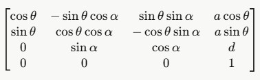
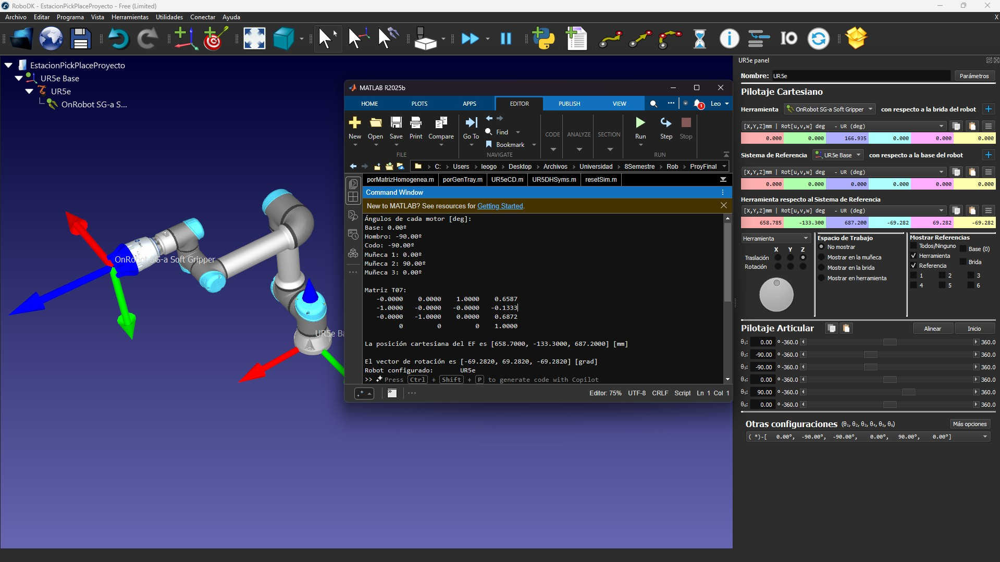
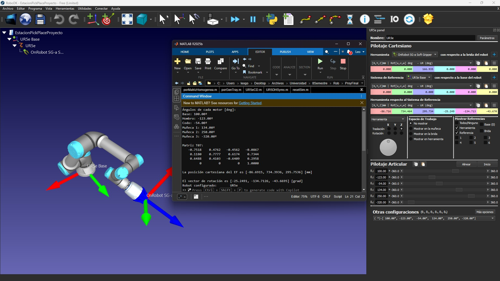
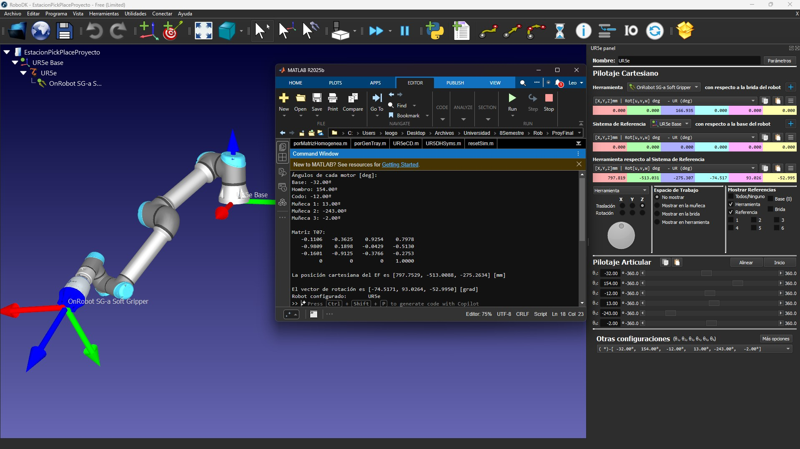

# Cinemática directa de UR5e

> Proyecto de Leo González Yamada

> Código `UR5eCD.m` del [repositorio del proyecto](https://github.com/LeoGonYama39/JustTheDocs_Robotica).

En esta sección, se explicará y demsotrará la **cinemática directa** de un **UR5e**. Como se explicó al inicio, la cinemática directa es fundamental para **cinemática inversa** y **control cinemático**, por lo que es importante tener el tema claro y hacerlo de forma inequívoca.

## Contenido
- [Método](#método)
- [Posición cartesiana](#posición-cartesiana)
- [Posición rotacional](#posición-rotacional)
- [Comprobación](#comprobación)

---

## Método

Para el cálculo de la matriz homogénea de base al EF, se usó la siguiente forma de matriz con parámetros de Devanit-Hatenberg:



Pero, tenemos que tomar en cuenta a la herramienta como un nuevo eje, por lo que agregaremos un **séptimo eje** a los parámetros de DH:

| **Eje** | **a [m]** | **d [m]** | **alpha [rad]** | **theta [rad]** |
|:-------:|:---:|:--------:|:-----------:|:-----------:|
| Joint 7 | 0 | 0.1669 | 0 | 0 |

Por lo tanto, multiplicaremos 7 matrices homogéneas para obtener nuestra matriz homogénea final, que es la que indica la pose del EF respecto a la base.

---

## Posición cartesiana

Para la posición cartesiana del efector final, simplemente hay que obtener el **vector de traslación**. La posición *x* corresponderá al primer elemento del **vector de traslación**, o el elemento (4, 1) de la **matriz homogénea**, para *y*, segundo elemento del **vector de traslación** o (4, 2) de la **matriz homogénea**, y para *z*, tercer elemento del **vector de traslación** o el elemento (4, 3) de la **matriz homogénea**.

> Para la comprobación con RoboDK, estos valores se multiplicaron por mil para representar los resultados en mm, debido a que RoboDK trabaja en mm y no en metros.

---

## Posición rotacional

Si bien, hay varias maneras de representar la **posición rotacional** de una matriz homogénea, UR usa una representación especial llamada *eje-ángulo*, la cuál, consiste de representar las 3 rotaciones *rx*, *ry* y *rz* como:

```text
r = u * theta
```

donde:
- **r** representa el vector con las 3 rotaciones.
- **u** representa el eje unitario de rotación (3x1).
- **theta** representa el ángulo de rotación.

Para el código, se usará la función `rotm2axang` del Add-On *Robotics System Toolbox*. Esta función recibe una matriz de rotación **R** y devuelve un vector con los 3 elementos del eje unitario de rotación (1:3), seguido del ángulo de rotación (4), por lo tanto, multiplicaremos el vector **u** con **theta** para obtener los ángulos **en radianes**.

> Para la comprobación con RoboDK, estos valores se transformaron de radianes a grados con la función `rad2deg`, debido a que RoboDK trabaja con grados y no con radianes.

---

## Comprobación

El código es capaz de recibir la posición articular de cada articulación del UR5e, y este calcula la cinemática directa, y a su vez se conecta a RoboDK para mover el UR5e con esas posiciones articulares y poder comprobar la cinemática directa.

### Prueba 1

En este caso, se calculará la cinemática directa con la posición de *inicio* o *home* que indica RoboDK para el UR5e. Se configuran las siguientes posiciones articulares:

- Base: 0.00º
- Hombro: -90.00º
- Codo: -90.00º
- Muñeca 1: 0.00º
- Muñeca 2: 90.00º
- Muñeca 3: 0.00º

Resultado:



Podemos ver un error de sólamente 0.08 mm en la posición X, por lo que podemos concluir que la cinemática directa se realizó con éxito.

### Prueba 2

En esta prueba, se hace lo mismo pero moviendo el robot a una posición más irregular, para comprobar si nuestro modelo de cinemática directa actúa de forma correcta en todos los casos. Se colocan las siguientes posiciones articulares:

- Base: 100.00º
- Hombro: -123.00º
- Codo: -54.00º
- Muñeca 1: 134.00º
- Muñeca 2: 250.00º
- Muñeca 3: -320.00º



Nuevamente, tenemos unos errores máximos en rangos de 0.01 mm, por lo tanto, podemos confirmar que el programa sí calcula de manera adecuada la cinemática directa, aún con posiciones irregulares.

### Prueba 3

Por último, se comprueba con una forma aún más irregular: El EF completamente en el eje *z* negativo. Se agregan las siguientes posiciones articulares:

- Base: -32.00º
- Hombro: 154.00º
- Codo: -12.00º
- Muñeca 1: 13.00º
- Muñeca 2: -243.00º
- Muñeca 3: -2.00º



Nuevamente, tenemos unos errores máximos en rangos de 0.01 mm, por lo tanto, podemos confirmar que el programa sí calcula de manera adecuada la cinemática directa, aún con posiciones irregulares.
