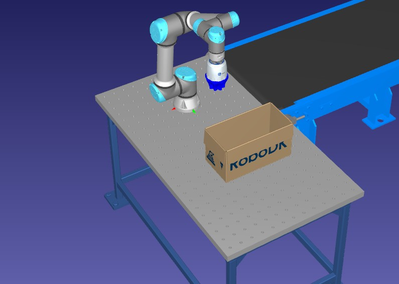
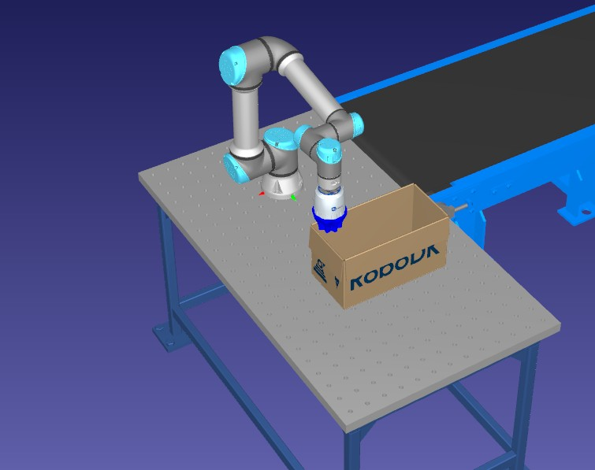
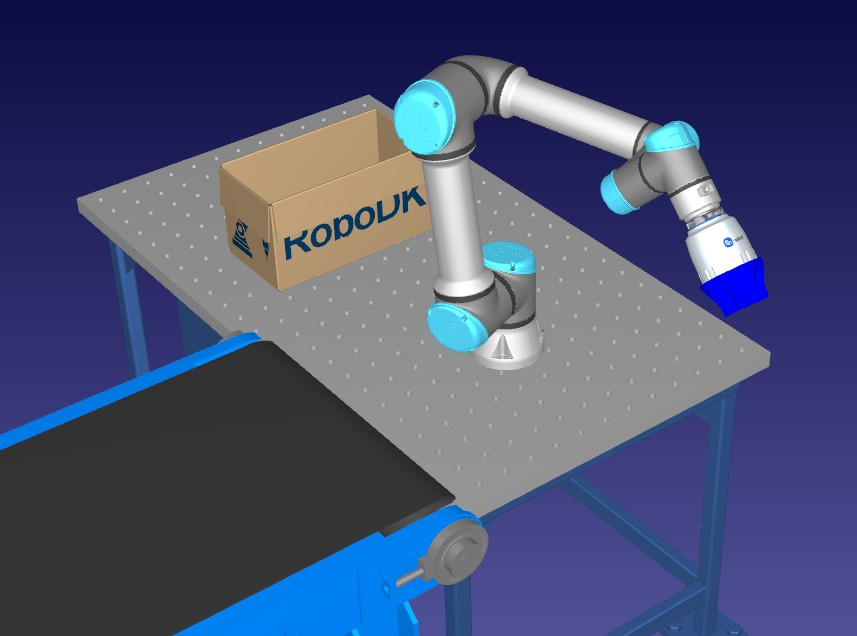
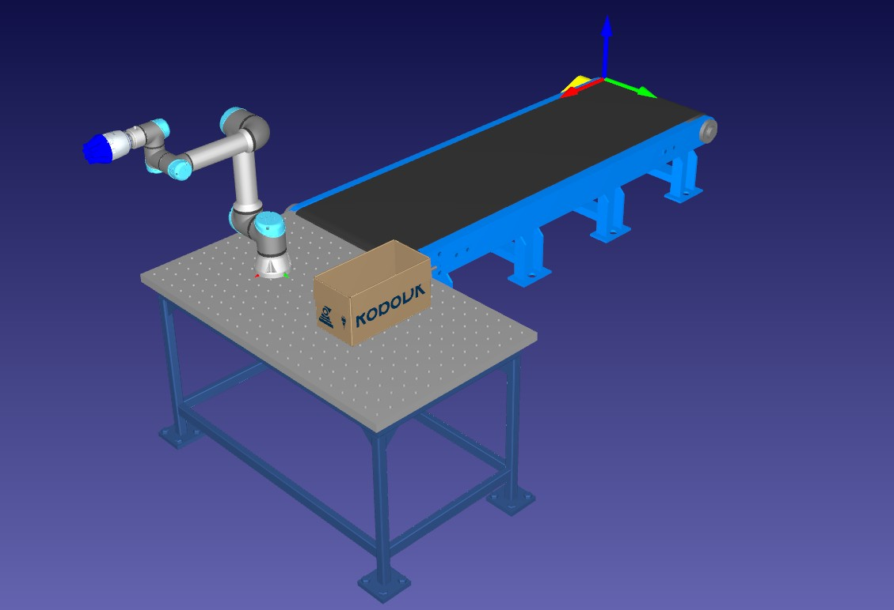

# Cinemática inversa de UR5

> Proyecto de Leo González Yamada

> Código `CI_proceso.m` del [repsitorio del proyecto](https://github.com/LeoGonYama39/JustTheDocs_Robotica).

En esta sección, se explicará y demsotrará la cinemática inversa de un UR5e efectuada en la aplicación industrial **Pick and Place** explicada en el inicio. 

## Contenido

- [Obtención de matrices](#obtención-de-matrices)
- [Inversa geométrica](#inversa-geométrica)
- [Explicación de la rutina](#explicación-de-la-rutina)
- [Demostración de la rutina](#demostración-de-la-rutina)
- [Análisis](#análisis)

---

## Obtención de matrices

Como se explicó en el inicio, cinemática inversa consiste en obtener las posiciones articulares del robot en función de la pose de su EF.

Por lo tanto, primero se mueve el robot a una posición deseada, y se obtiene su matriz homogénea mediante RoboDK, y luego se guarda en el programa.

> Debido a que el método de cinemática inversa que veremos más adelante, no toma en cuenta un eslabón 7, se sumará la longitud de la herramienta al eje z en cada matriz homogénea usada para la cinemática inversa.

### Ejemplos

**Una de las poses previas a dejar la botella en la caja:**



De la siguiente pose, RoboDK nos entrega la siguiente matriz homogénea:

```text
[ 1.00,     0.00,     0.00,   110.00 ;
  0.00,    -1.00,     0.00,   500.00 ;
  0.00,     0.00,    -1.00,   500.00 ;
  0.00,     0.00,     0.00,     1.00 ];
```

**Una de las poses del robot dejando la botella:**



De la siguiente pose, RoboDK nos entrega la siguiente matriz homogénea:

```text
[ 1.00,     0.00,     0.00,   110.00 ;
  0.00,    -1.00,     0.00,   500.00 ;
  0.00,     0.00,    -1.00,   230.00 ;
  0.00,     0.00,     0.00,     1.00 ];
```

**Pose con rotación distinta**

Debido a la naturaleza del Pick and Place, no se suele cambiar la rotación del EF, por lo tanto, meteremos en la rutina un movimiento donde se cambie la rotación para demostrar cómo se puede lograr cualquier rotación deseada, y no sólamente una fija.



De la siguiente pose, RoboDK nos entrega la siguiente matriz homogénea (con la longitud de la herramienta sumada en z):

```text
[-0.999572,     0.020599,    -0.020767,    20.147554 ;
  0.029250,     0.706518,    -0.707090,  -499.548022 ;
  0.000107,    -0.707395,    -0.706818,   541.118414 ;
  0.000000,     0.000000,     0.000000,     1.000000 ];
```

De esta forma, vamos obtieniendo cada una de las posiciones que queremos que realize el UR5e en nuestro proceso industrial.

## Inversa geométrica

Para la cinemática inversa, se usó la inversa geométrica, el cuál es un método que consiste en describir las posiciones de las articulaciones del robot mediante geometría, lo que traduce a senos y cosenos. Esto en un principio podría sonar a un mayor gasto de recursos computacionales, pero se usa este método por encima de otros como el **Método de Newton**, el cuál es *iterativo*, mientras que **inversa geométrica** son unos cálculos, sin iterar más de una vez.

Se utilizó el código de inversa geométrica del maestro **Julio Antonio Caballero Mora**, el cuál está integrado en el código de esta sección (`CI_proceso.m`).

## Explicación de la rutina

A continuación, se muestral a estación de trabajo en RoboDK:


La rutina consiste en:

1. Se inicia siempre con el robot en la posoción de *home*.
2. Se genera una botella.
3. La botella se va moviento por la banda transportadora hasta llegar a una posición cercana al robot.
4. El UR5e se mueve encima de la botella transportada, preparándose para agarrarla.
5. El UR5e realiza un *MoveL* (movimiento sin cambiar la orientación del EF), de tal forma que el Gripper rodee a la botella.
6. El Gripper agarra la botella.
7. El UR5e vuelve a hacer un *MoveL* para regresar a la posición encima de la botella (pero con la botella agarrada).
8. Si es la primera botella, el robot primero se mueve a la posición con la rotación alterna, demostrando que se pueden poner varias rotaciones al EF.
9. El robot se mueve a la posición inicial de la botella correspondiente a dejar.
10. El robot realiza un *MoveL* para dejar la botella en la caja.
11. El Gripper suelta la botella.
12. El UR5e regresa a la posición encima de la botella colocada.
13. Si ya llenó la caja, el robot procede a moverse a su posición de *home*. sin embargo, si la caja no se ha llenado con las 10 botellas, se regresa al paso 2.

## Demostración de la rutina

A continuación, un video de la rituna:

<iframe width="560" height="315" src="https://www.youtube.com/embed/IgU2Fp70z3w" title="YouTube video player" frameborder="0" allow="accelerometer; autoplay; clipboard-write; encrypted-media; gyroscope; picture-in-picture; web-share" referrerpolicy="strict-origin-when-cross-origin" allowfullscreen>
</iframe>

---

## Análisis

Después de haber visto la rutina funcionando, podemos concluir que:
- Se logró hacer parte de una cadena de producción industrial, concretamente la parte de colocar las botellas en una caja.
- El robot coloca las botellas de forma recta, sin ninguna inclinación en su rotación x o y.
- Se evita que el robot colicione con algún objeto de la mesa de trabajo, como lo pueden ser botellas ya colocadas o la caja, y esto se logra siempre asegurándonos de que el robot se encuentre encima de la posición de la botella, antes y después de agarrar la botella.

Pero todvía tendríamos un problema, y es que estamos completamente atados a las funciones `MoveJ` y `MoveL` de los robots UR, y como estos son de arquitectura cerrada, si queremos controlar la velocidad del EF (por ejemplo si queremos dejar las botellas en la caja de manera más delicada), tenemos que encontrar una manera de hacerlo mediante las funciones `MoveJ` y `MoveL`.